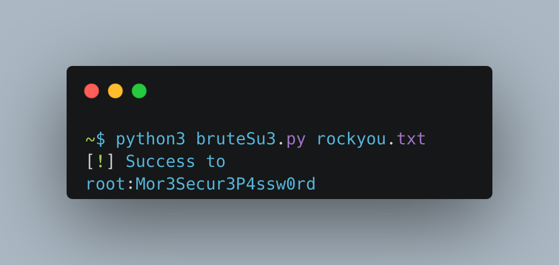

# <p align="center" width="100px" heigth="100px"></p>

> It's your last resort (or the first for many) for escalating privileges? > Let's go brute force on the /etc/passwd users.

### To python3 use:
```sh
python3 bruteSu3.py wordlist.txt
```

### To python2 use:
```sh
python2 bruteSu2.py wordlist.txt
```
