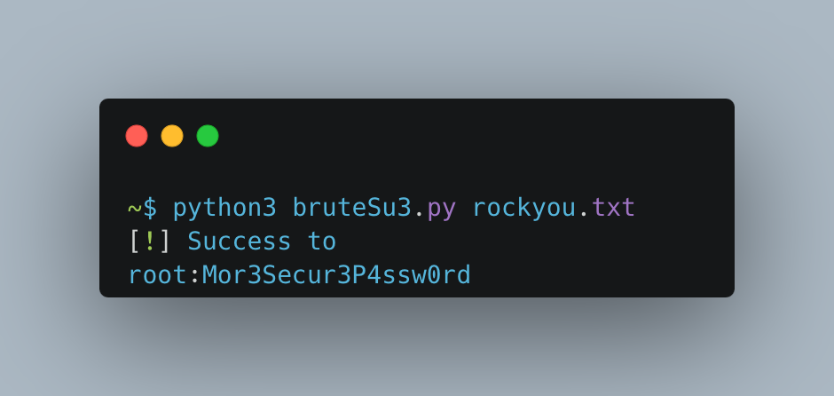

<h1 align="center"></h1>

<h4 align="center">Brute-force local Linux accounts via <code>su</code> against the users in /etc/passwd</h4>

<p align="center">
  <a href="#about">About</a> •
  <a href="#install">Install</a> •
  <a href="#usage">Usage</a> •
  <a href="#license">License</a>
</p>

<p align="center">
  
  
  
  
</p>

## About

`bruteSu` is a small privilege-escalation helper for when you already have a shell
on a Linux host. It reads every user listed in `/etc/passwd` and tries each password
from your wordlist against them with `su`, one thread per user. When a pair works it
prints `[!] Success to user:password`.

Two scripts are provided so you can run it with whatever Python is available on the
target: `bruteSu3.py` (Python 3) and `bruteSu2.py` (Python 2).

## Install

```bash
git clone https://github.com/phor3nsic/bruteSu
cd bruteSu
```

No external dependencies — it only uses the standard library and the `su` / `cut`
binaries already present on the host.

## Usage

```bash
# Python 3
python3 bruteSu3.py wordlist.txt

# Python 2
python2 bruteSu2.py wordlist.txt
```

| Argument     | Description                                  |
|--------------|----------------------------------------------|
| `wordlist.txt` | Path to a newline-separated password list  |

The list of target users is collected automatically from `/etc/passwd`.

## Examples

```bash
$ python3 bruteSu3.py /usr/share/wordlists/rockyou.txt
[!] Success to user:password123
```

## Disclaimer

For authorized security testing and education only. You are responsible for how you use it.

## License

[MIT](LICENSE) © [phor3nsic](https://github.com/phor3nsic)
